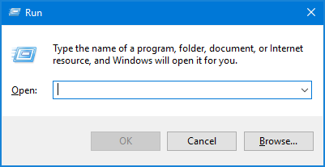
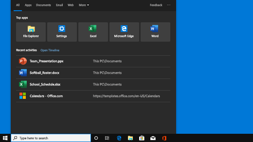

# Table of Contests

- [Windows](#windows)
	- [Apps](#apps)
	- [Shortcuts](#shortcuts)
	- [File Explorer](#file-explorer)
- [Chrome](#chrome)
	- [Google Translate](#google-translate)

# Windows 
## Apps
All apps you can run using [`Windows Run`](#) or by simply typing in the `Windows Search`

	
Windows Run & Windows Search

	Windows Run :
	 
	
	 
	Windows Search :
	 
	

Name | Function 
-|-|
`SndVol.exe` | Sound Mixer
`main.cpl` | Mouse Settings
`mmsys.cpl` | Sound Settings
`appwiz.cpl` | Pick app to uninstall
`control` | Control Panel
`msconfig` | System Configuration Utility
`devmgmt.msc` | Device Manager
`winver` | Shows your windows version

## Shortcuts

Key | Function
:-:|-
<kbd>F2</kbd> | Rename the selected item
<kbd>F3</kbd> | Search for a file or folder in File Explorer.
<kbd>F4</kbd> | Display the address bar list in File Explorer
<kbd>F5</kbd> | Refresh the active window
<kbd>F6</kbd> | Cycle through screen elements in a window or on the desktop
<kbd>F10</kbd> | Activate the Menu bar in the active app
<kbd>Alt</kbd> + <kbd>Esc</kbd> | Cycle through items in the order in which they were opened
<kbd>Alt</kbd> + <kbd>Enter</kbd> | Display properties for the selected item

Key | Function
-|-
<kbd>Win</kbd> | Open or Close Start
<kbd>Win</kbd> + <kbd>A</kbd> | Show Notifications
<kbd>Win</kbd> + <kbd>D</kbd> | Display and hide the Desktop
<kbd>Win</kbd> + <kbd>Alt</kbd> + <kbd>D</kbd> | Display and hide the date and time on the desktop
<kbd><kbd>Win</kbd></kbd> + <kbd>E</kbd> | Open File Explorer
<kbd>Win</kbd> + <kbd>I</kbd> | Open Settings
<kbd>Win</kbd> + <kbd>L</kbd> | Lock your PC
<kbd>Win</kbd> + <kbd>M</kbd> | Minimize all Windows
<kbd>Win</kbd> + <kbd>P</kbd> | Show Display Options
<kbd>Win</kbd> + <kbd>P</kbd> |  Open the Run dialog box
<kbd>Win</kbd> + <kbd>S</kbd> | Open Windows Serach
<kbd>Win</kbd> + <kbd>T</kbd> | Cycle through apps on the taskbar
<kbd>Win</kbd> + <kbd>V</kbd> | Show Clipboard History
<kbd>Win</kbd> + <kbd>TAB</kbd> | Show Task View
<kbd>Win</kbd> + <kbd>1 - 9</kbd> | Run Taskbar App
<kbd>Win</kbd> + <kbd>🡠🡡🡣🡢</kbd> | Move Window
<kbd>Win</kbd> + <kbd>,</kbd> | Temporarily peek at the desktop
<kbd>Win</kbd> + <kbd>;</kbd> | Open emoji panel
<kbd>Alt</kbd> + <kbd>TAB</kbd> | Switch Apps

## File Explorer

Name | Function
-|-
<kbd>Alt</kbd> + <kbd>D</kbd> | Select the address bar
<kbd>Ctrl</kbd> + <kbd>E</kbd> | Select the search box
<kbd>Ctrl</kbd> + <kbd>F</kbd> | Select the search box
<kbd>Ctrl</kbd> + <kbd>N</kbd> | Open a new window
<kbd>Ctrl</kbd> + <kbd>W</kbd> | Close the active window
<kbd>Ctrl</kbd> + Scroll | Change the size and appearance of file and folder icons
<kbd>Ctrl</kbd> + <kbd>Shift</kbd> + <kbd>N</kbd> | Create a new folder
<kbd>Alt</kbd> + <kbd>🡡</kbd> | View the folder that the folder was in
<kbd>Alt</kbd> + <kbd>🡢</kbd> | View the next folder
<kbd>Alt</kbd> + <kbd>🡠</kbd>| View the previous folder
<kbd>Alt</kbd> + <kbd>Enter</kbd> | Open the Properties dialog box for the selected item

# Chrome

Name | Function
-|-
<kbd>Ctrl</kbd> + <kbd>N</kbd> | Open New Window
<kbd>Ctrl</kbd> + <kbd>T</kbd> | Open New Tab
<kbd>Ctrl</kbd> + <kbd>W</kbd> | Close Tab
<kbd>Ctrl</kbd> + <kbd>Shift</kbd> + <kbd>T</kbd> | Open Closed Tab
Middle Click / <kbd>Ctrl</kbd> + Left Click| Open in a New Tab
<kbd>Shift</kbd> + <kbd>Esc</kbd> | Open Task Manager

## Google Translate

Key | Function
-|-
<kbd>Ctrl</kbd> + <kbd>Shift</kbd> + <kbd>S</kbd> | Switch Translated Language